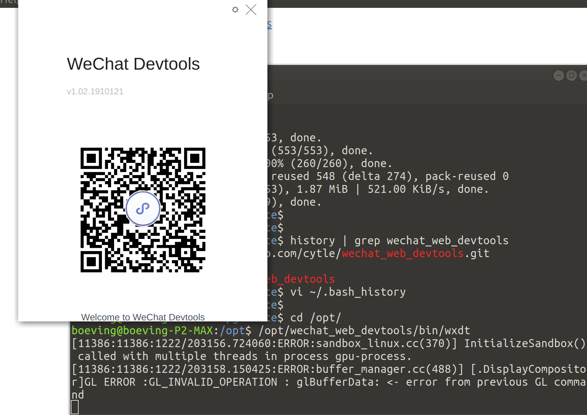
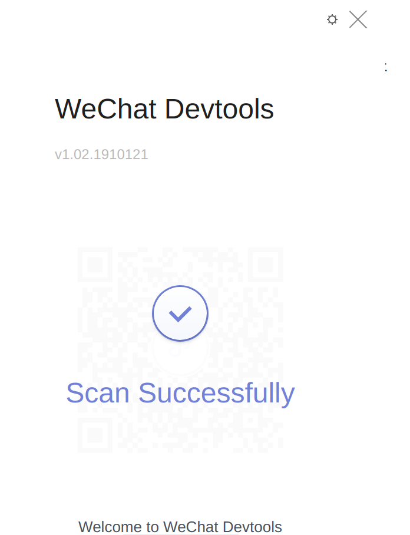

## 1.安装


由于我的电脑是ubuntu 的系统，所以安linux版的


项目地址
https://github.com/cytle/wechat_web_devtools


```shell

cd /opt/
git clone https://github.com/cytle/wechat_web_devtools.git
cd wechat_web_devtools/
./bin/wxdt install
./bin/wxdt
```


运行启动后就是这样




## 2.设置


用手机微信扫描



