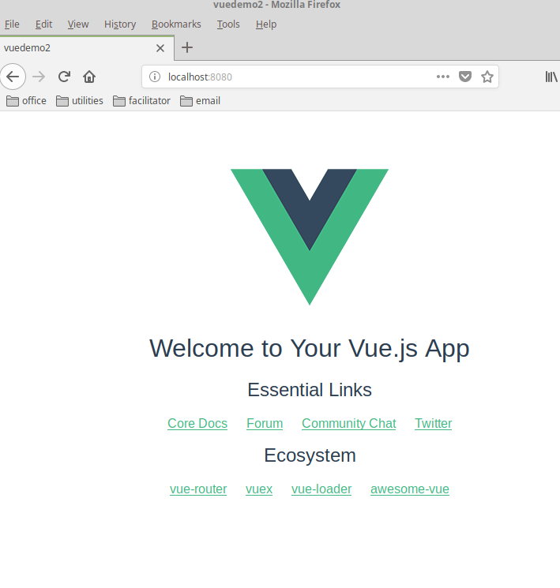

# 环境搭建

## 安装nodejs

`apt-get install nodejs`

```
boeving@mint19:~$ nodejs -v
v8.10.0
boeving@mint19:~$ npm -v
3.5.2
boeving@mint19:~$ 
```

## 配置npm仓库

因为国内的网络环境，直接从npm官方源安装软件包速度会比较慢，甚至导致安装不成功。
我们可以安装nrm工具，用于管理软件源。

`$ sudo npm install -g nrm`

安装完成之后，列出可用的软件源
```
$ nrm ls
* npm ---- https://registry.npmjs.org/
  cnpm --- http://r.cnpmjs.org/
  taobao - https://registry.npm.taobao.org/
  nj ----- https://registry.nodejitsu.com/
  rednpm - http://registry.mirror.cqupt.edu.cn/
  npmMirror  https://skimdb.npmjs.com/registry/
  edunpm - http://registry.enpmjs.org/
```

在国内，我们可以使用taobao的源，速度还相对不错。

```
$ nrm use taobao
                        
Registry has been set to: https://registry.npm.taobao.org/
```


配置代理

另外，如果在特定网络环境下需要配置代理的话，可以使用如下命令配置。

```
$ npm config set proxy http://127.0.0.1:3128
$ npm config set http-proxy http://127.0.0.1:3128
$ npm config set https-proxy https://127.0.0.1:3128
```


## 搭建vue 开发环境 

安装 vue的脚手架工具-vue 命令行工具

`npm install --global vue-cli`
`npm install --global vue`
`npm install -g webpack`


确认安装成功


```
boeving@mint19:~$ vue -V
2.9.6
boeving@mint19:~$ npm list|grep vue
└─┬ vue-cli@2.9.6
boeving@mint19:~$ 
```

## 创建项目


vue init webpack [project-name]

```
boeving@mint19:/bighome/mycode/html$ vue init webpack vuedemo

? Project name vuedemo
? Project description 
? Author boevin
? Vue build standalone
? Install vue-router? Yes
? Use ESLint to lint your code? No
? Set up unit tests Yes
? Pick a test runner jest
? Setup e2e tests with Nightwatch? Yes
? Should we run `npm install` for you after the project has been created? (recommended) (Use arrow keys)
❯ Yes, use NPM 
...
...

npm WARN optional Skipping failed optional dependency /sane/fsevents:
npm WARN notsup Not compatible with your operating system or architecture: fsevents@1.2.9
npm WARN optional Skipping failed optional dependency /chokidar/fsevents:
npm WARN notsup Not compatible with your operating system or architecture: fsevents@1.2.9

# Project initialization finished!
# ========================

To get started:

  cd vuedemo
  npm run dev
  
Documentation can be found at https://vuejs-templates.github.io/webpack


```


＊如果创建不成功，就用 cnpm install / npm install
cd project-name-dir
npm run dev


运行
npm run dev


## 第二种创建项目的方式

这种方式创建的项目结构更轻小，创建过程更快、更简单

vue init webpack-simple [project-name]

cd project-name-dir

cnpm install / npm install

npm run dev

```
boeving@mint19:/bighome/mycode/html$ vue init webpack-simple vuedemo2

? Project name vuedemo2
? Project description A Vue.js project
? Author 
? License MIT
? Use sass? Yes

   vue-cli · Generated "vuedemo2".

   To get started:
   
     cd vuedemo2
     npm install
     npm run dev

boeving@mint19:/bighome/mycode/html$
```

然后根本它的提示进入项目目录完成  npm install，npm run dev

我们往后的项目创建都建议使用第二种方式

```
boeving@mint19:/bighome/mycode/html/vuedemo2$ npm install 
npm WARN deprecated browserslist@1.7.7: Browserslist 2 could fail on reading Browserslist >3.0 config used in other tools.
npm WARN deprecated flatten@1.0.2: I wrote this module a very long time ago; you should use something else.
npm WARN prefer global node-gyp@3.8.0 should be installed with -g

> node-sass@4.12.0 install /bighome/mycode/html/vuedemo2/node_modules/node-sass
> node scripts/install.js

Downloading binary from https://github.com/sass/node-sass/releases/download/v4.12.0/linux-x64-57_binding.node
Download complete  ] - :
Binary saved to /bighome/mycode/html/vuedemo2/node_modules/node-sass/vendor/linux-x64-57/binding.node
Caching binary to /home/boeving/.npm/node-sass/4.12.0/linux-x64-57_binding.node

> core-js@2.6.9 postinstall /bighome/mycode/html/vuedemo2/node_modules/core-js
> node scripts/postinstall || echo "ignore"


> uglifyjs-webpack-plugin@0.4.6 postinstall /bighome/mycode/html/vuedemo2/node_modules/uglifyjs-webpack-plugin
> node lib/post_install.js


> node-sass@4.12.0 postinstall /bighome/mycode/html/vuedemo2/node_modules/node-sass
> node scripts/build.js

Binary found at /bighome/mycode/html/vuedemo2/node_modules/node-sass/vendor/linux-x64-57/binding.node
Testing binary
Binary is fine
vuedemo2@1.0.0 /bighome/mycode/html/vuedemo2
├─┬ babel-core@6.26.3 
│ ├─┬ babel-code-frame@6.26.0 
...
....

boeving@mint19:/bighome/mycode/html/vuedemo2$ npm run dev

> vuedemo2@1.0.0 dev /bighome/mycode/html/vuedemo2
> cross-env NODE_ENV=development webpack-dev-server --open --hot

Project is running at http://localhost:8080/
webpack output is served from /dist/
404s will fallback to /index.html
{ parser: "babylon" } is deprecated; we now treat it as { parser: "babel" }.


```

创建好后，一般它会自动启用浏览器访问 http://localhost:8080，就能看到项目了



## 修改运行端口

用webpack-simple方式创建的项目，在 package.json配置文件里，scripts => dev 参数后面加上端口信息
```
  "scripts": {
    "dev": "cross-env NODE_ENV=development webpack-dev-server --open --hot --port 8082",
    "build": "cross-env NODE_ENV=production webpack --progress --hide-modules"
  },
```

修改配置要先停止运行中的vue项目，然后配置好后再启动

```
boeving@mint19:/bighome/mycode/html/vuedemo2$ head package.json 
{
  "name": "vuedemo2",
  "description": "A Vue.js project",
  "version": "1.0.0",
  "author": "",
  "license": "MIT",
  "private": true,
  "scripts": {
    "dev": "cross-env NODE_ENV=development webpack-dev-server --open --hot --port 8082",
    "build": "cross-env NODE_ENV=production webpack --progress --hide-modules"
boeving@mint19:/bighome/mycode/html/vuedemo2$ 
boeving@mint19:/bighome/mycode/html/vuedemo2$ npm run dev

> vuedemo2@1.0.0 dev /bighome/mycode/html/vuedemo2
> cross-env NODE_ENV=development webpack-dev-server --open --hot --port 8082

Project is running at http://localhost:8082/
webpack output is served from /dist/
404s will fallback to /index.html
{ parser: "babylon" } is deprecated; we now treat it as { parser: "babel" }.


```

另外我们还可以指定访问host 信息，不上本机能访问
`"dev": "cross-env NODE_ENV=development webpack-dev-server --open --hot --host 0.0.0.0 --port 8082"`


